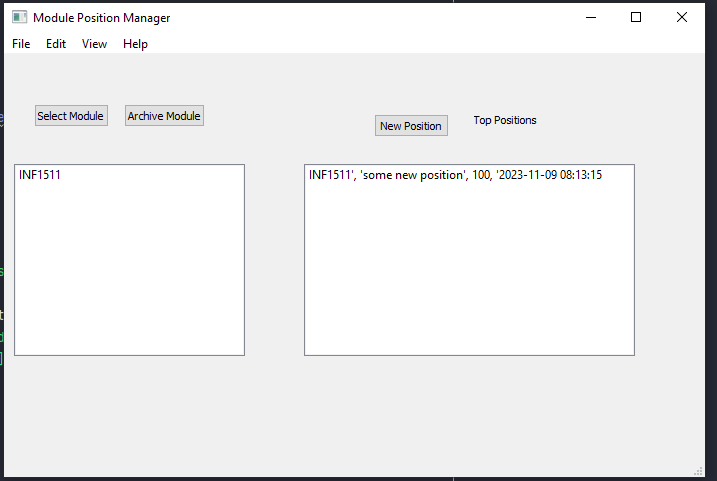
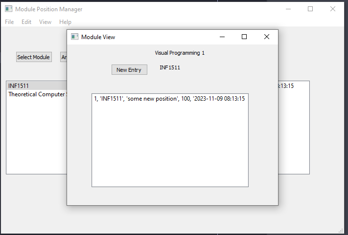
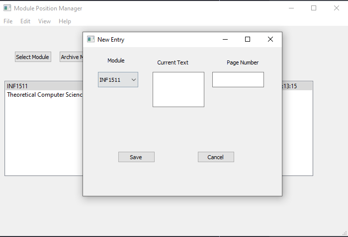

# positionMarker  
This is a simple PyQT app to mark the current position of your studies.  
I generally did this by saving a notepad and adding a timestamp with my page number and the name of the current text.  
This was just a fun app to practice some Qt Designer and Python.  
This is also my first exposure to SQL Lite, although I've played on much more robust DBMSs, it was good fun.  

## How to use
1. Download the repo
2. Install the requirements
3. Run the app

